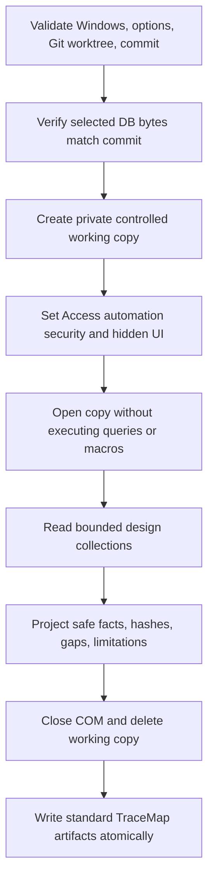

# Microsoft Access Adapter v0 Runway Design

## Overview

The Access adapter is a Windows-local evidence producer that converts an Access
binary design into TraceMap's existing artifact contract. It is deliberately not
an Access migration engine, SQL executor, data profiler, runtime tracer, or cloud
upload client.

The safest implementation sequence is:

1. establish CLI, Git provenance, controlled-copy handling, COM safety, standard
   writers, structural schema/query inventory, and hostile-canary tests;
2. add form/report/control and binding evidence;
3. add bounded VBA declarations, call candidates, and event-procedure mapping;
4. add macro/external-link boundary depth and downstream report composition;
5. validate against a representative local-only sample without committing
   customer artifacts.

Only step 1 should be attempted in the first implementation PR.

## Architecture

### Project Layout

Preferred layout:

```text
src/dotnet/TraceMap.Access/
  AccessScanOptions.cs
  AccessEnvironmentProbe.cs
  AccessWorkingCopy.cs
  AccessComSession.cs
  AccessCatalogReader.cs
  AccessQueryProjector.cs
  AccessSurfaceReader.cs          # later slice
  AccessVbaProjector.cs           # later slice
  AccessFactBuilder.cs
  AccessScanRunner.cs

src/dotnet/TraceMap.Access.Cli/
  Program.cs

src/dotnet/tests/TraceMap.Tests/
  Access*.Tests.cs                # platform-neutral unit/contract tests

scripts/access-validation/
  New-SyntheticAccessFixture.ps1  # Windows + Access integration fixture
  Invoke-AccessSmoke.ps1
```

`TraceMap.Access` should target the same supported .NET runtime as the solution
and use runtime platform/COM checks rather than an Office primary interop
assembly dependency. COM activation can use `Type.GetTypeFromProgID` and bounded
`dynamic` calls behind small interfaces. This keeps normal macOS/Linux solution
builds possible while the scan command fails cleanly before COM use.

The Access CLI should write the same storage model as other adapters and reuse
existing manifest, hashing, safe-value, rule-catalog, SQLite, NDJSON, report, and
log helpers where practical. It should not fork a second artifact schema.

### Process Boundary and Watchdog

The public `tracemap-access` process is a supervisor. It creates a unique scan
token and private working directory, then launches the same executable in a
non-public worker mode for all COM interaction. The worker reports the exact
Access process ID derived from the `Application.Hwnd` it created, together with
the scan token, before opening the database. The supervisor accepts safe
projected evidence over a bounded local IPC channel; raw SQL, connection values,
VBA, macro bodies, and absolute paths never cross that channel.

The default total worker timeout is ten minutes. A bounded
`--timeout-seconds` option may allow 30 through 3600 seconds and must participate
in normalized scan options. The 3600-second ceiling is a v0 bound and may be
revisited by a later phase with new limit/canary evidence. The supervisor also
enforces an IPC heartbeat/idle
timeout. On timeout, pipe failure, or worker crash, it terminates the worker and
only the recorded Access PID whose creation time/session token match the worker
handshake. Where supported, both processes should be assigned to a Windows Job
Object configured for kill-on-close. The adapter must never kill processes by
the `MSACCESS.EXE` name or touch an Access instance it did not create. A timed-out
scan fails without a successful artifact set; bounded stderr may report the
classification, but never the private working path.

If Job Object assignment is unavailable or rejected, validated owned-PID
termination remains the authoritative fallback. Modal trust/repair prompts are
not considered safely suppressible merely because macros are disabled; a prompt
that blocks COM is treated as a worker hang and resolved through the same
timeout and owned-process path.

On the normal path, every COM object is released in reverse acquisition order
in `finally`. The worker calls `CloseCurrentDatabase`/`Quit` when available,
releases RCWs, and exits. If those calls hang, the supervisor timeout remains
authoritative and performs the owned-process cleanup above.

## Scan Workflow



Failures before useful design extraction do not produce a successful artifact
set. Failures after useful evidence exists may produce a reduced scan only when
the manifest and rule-backed gaps accurately describe what was missed.

## Git and Input Provenance

The CLI contract should be:

```text
tracemap-access scan \
  --repo <git-worktree> \
  --database <repo-relative.accdb-or-mdb> \
  --out <output-directory>
```

The implementation must:

- resolve and canonicalize the Git root;
- reject absolute database arguments and traversal outside the root; relative
  path validation must normalize separators, split into segments, and inspect
  individual segments rather than relying on slash-delimited substring checks;
- reject symlink/reparse-point escape;
- resolve a concrete commit SHA;
- verify the selected path is tracked at `HEAD`;
- compare the working-tree file SHA-256 to the blob material attributed to
  `HEAD`, or otherwise use a deterministic Git check that rejects modified or
  untracked input;
- derive database identity from repository identity, commit SHA,
  repository-relative path, and database content hash;
- exclude output path, temporary path, timestamp, process identity, and local
  checkout path from scan/fact identity.

The database content hash is provenance and may persist. It is not a substitute
for repo and commit SHA.

V0 always attributes evidence to the checked-out `HEAD`; a historical revision
must be checked out before scanning. Git LFS input is accepted only when the
working file contains materialized database bytes and clean-input verification
can prove those bytes correspond to the `HEAD` LFS object. Pointer-only,
smudged-but-unverifiable, or unavailable LFS content fails before Access opens.

For a standalone customer file, the documented operator workflow is to create a
local restricted Git evidence workspace, copy the file into it, commit locally,
and scan that commit. TraceMap must not upload or push that workspace.

## Working-Copy and COM Safety

### Controlled Copy

The original database is never opened by Access. The adapter:

1. creates a private temporary directory with restrictive ACLs;
2. copies the selected database bytes without preserving unsafe alternate data
   streams or writable sharing;
3. hashes and compares the copy;
4. opens only the copy;
5. deletes Access lock files and the working directory on every exit path;
6. reports cleanup failure locally without persisting the absolute path.

The working copy protects the original from Access lock files, format upgrades,
repair prompts, or incidental writes. It does not make a hostile binary safe;
VM/OS isolation remains an operator control.

### Startup and Execution Suppression

Before `OpenCurrentDatabase`, set Access automation security to force-disable
macros and keep the application invisible. The exact COM property/value must be
isolated behind a named constant and integration-tested against an AutoExec and
startup-form canary.

The reader must never call methods whose purpose is to execute or materialize
data, including:

- `DoCmd.*` execution methods;
- `QueryDef.Execute`;
- `OpenQuery`, `OpenForm`, or `OpenReport` for user objects;
- `OpenRecordset`;
- `DLookup`, `DCount`, or other domain functions;
- table/link refresh;
- query result field enumeration for pass-through/action/DDL/unsafe kinds;
- macro execution or `RunCode`;
- VBA procedure invocation.

DAO catalog collections may be used for tables, fields, indexes, relations, and
query definitions without opening recordsets. Access project collections may be
used for names/design properties only after macro security is forced off.

### Bounded Extraction

Use deterministic defaults with explicit maximums for:

- database bytes;
- objects per collection;
- fields/controls per object;
- property string length read into memory;
- query SQL bytes hashed/projected;
- VBA module bytes/lines inspected;
- facts/gaps/diagnostics emitted;
- total scan duration.

The adapter must also enforce aggregate fact count, aggregate gap count,
aggregate safe-projection bytes, and final artifact-byte ceilings. The concrete
defaults are versioned scan options recorded in implementation-state before
coding. Concurrent scans use distinct tokenized working directories and cannot
share a mutable intermediate file.

Limit hits produce gaps and reduced coverage. They do not truncate silently.

## Evidence Model

### Proposed Rule IDs

No fact may ship until its rule exists in `rules/rule-catalog.yml`.

| Rule ID | Purpose | Default tier |
| --- | --- | --- |
| `legacy.access.database.inventory.v1` | Database/file and Access capability inventory | Tier2Structural |
| `legacy.access.schema.v1` | Tables, fields, indexes, keys, relationships | Tier2Structural |
| `legacy.access.query.v1` | Saved-query declaration, shape, hash, references | Tier2Structural or Tier3SyntaxOrTextual |
| `legacy.access.ui-surface.v1` | Form/report/control design inventory | Tier2Structural |
| `legacy.access.binding.v1` | Direct record/control/row-source bindings | Tier2Structural or Tier3SyntaxOrTextual |
| `legacy.access.vba.v1` | VBA declarations and bounded call candidates | Tier3SyntaxOrTextual |
| `legacy.access.event-binding.v1` | Event property to same-module procedure candidates | Tier3SyntaxOrTextual |
| `legacy.access.external-link.v1` | Hashed linked/pass-through/external boundaries | Tier2Structural |
| `legacy.access.macro-gap.v1` | Macro/startup/data-macro inventory and omitted-body gaps | Tier4Unknown |
| `legacy.access.coverage-gap.v1` | Platform, provider, trust, parse, limit, or unsupported gaps | Tier4Unknown |

Every catalog entry must repeat relevant non-claims and secret-safety limits.

### Proposed Facts

Reuse shared facts where their semantics are exact:

- `FileInventoried` for the selected database;
- `LegacyDataMetadataDeclared` for the Access database catalog;
- `LegacyDataEntityDeclared` and `LegacyDataStorageObjectDeclared` for local
  tables;
- `LegacyDataColumnDeclared` for declared fields;
- `LegacyDataMappingDeclared` for unambiguous declared relationships;
- `QueryPatternDetected` and `SqlTextUsed` only for compatible safe query-shape
  evidence;
- `AnalysisGap` for every unable-to-prove boundary.

Add Access-specific facts where shared vocabulary would blur meaning:

- `AccessQueryDeclared`;
- `AccessQueryDependencyCandidate`;
- `AccessFormDeclared`;
- `AccessReportDeclared`;
- `AccessControlDeclared`;
- `AccessBindingDeclared`;
- `AccessVbaModuleDeclared`;
- `AccessVbaProcedureDeclared`;
- `AccessEventBindingCandidate`;
- `AccessNavigationCandidate`;
- `AccessExternalLinkDeclared`;
- `AccessMacroDeclared`.

The first implementation slice needs only the shared schema facts,
`AccessQueryDeclared`, `AccessQueryDependencyCandidate`,
`AccessExternalLinkDeclared`, and `AnalysisGap`.

### Evidence Paths and Lines

An Access database is a binary container, not a text file. For catalog objects,
use the repository-relative database path and span `1:1`. Store:

- `accessObjectKind`;
- safe `accessObjectName` or `accessObjectNameHash`;
- `accessObjectStableKey`;
- design/content hash where available;
- limitations explaining that `1:1` anchors the containing binary, not a source
  line.

For VBA, the Access `CodeModule` line coordinate is meaningful inside the module.
Use that line span plus `moduleStableKey`; never fabricate a filesystem `.bas`
path or export source just to obtain line evidence.

## Safe Property Contracts

### Schema

Allowed safe properties include object kind, safe/hash identity, field ordinal,
Access type family, declared size, required/nullability flag, index kind,
relationship attributes, endpoint stable keys, and supporting fact IDs.

Never inspect or persist row values, defaults requiring evaluation, validation
messages, captions/descriptions that may contain business prose, attachment/OLE
contents, or lookup result values in v0.

### Queries

Allowed properties include:

- `queryKind`;
- `sqlHash` and `sqlLength`;
- parameter count and safe/hash parameter identities;
- safe referenced local object keys;
- `referenceCoverage=complete|partial|unknown`;
- provider family classification;
- full role-separated connection hash;
- flags such as `returnsRecords`, `isPassThrough`, or `isAction` only when they
  come from design metadata and do not cause execution.

Forbidden properties include raw SQL, raw connection strings, raw DSNs, raw
URLs/hosts/paths, credential fragments, scheduled commands, and query results.

The query projector must tokenize only supported Access SQL identifier contexts
and ignore comments/string values except while computing the whole-text hash.
Dynamic/ambiguous shapes emit gaps.

### Forms, Reports, and Controls

Allowed properties include safe/hash object identity, surface/control kind,
bound-state classification, module presence, design hash, direct safe target
keys, source expression hash/length/kind, event category, and supporting IDs.

Do not persist captions, labels, status text, validation text, literal form
values, filters, raw record/control/row-source expressions, macro bodies, images,
or embedded OLE data.

### VBA

Allowed properties include module kind, module hash, line count, procedure kind,
safe/hash procedure identity, declaration/call line span, call kind, safe/hash
literal target, expression hash, and supporting IDs.

Strings and comments must be excluded from call matching except when a supported
API requires a literal target; even then, persist the target only if it passes a
role-specific safe identifier policy, otherwise persist a hash. Never emit source
snippets.

The Phase 8 v0 product boundary does not acquire VBA source. It reads only the
bounded `CurrentProject.AllModules.Count` and uses
`Application.Modules.Count` solely as a before/after loaded-state canary. The
product emits the module count when available, zero VBA identity/flow facts,
and rule-backed `AccessVbaProjectUnavailable` with
`count-observed-source-unavailable` coverage. The deterministic projector is
retained and tested as a future input boundary, but wiring `Application.VBE`,
`ActiveVBProject`, `VBComponents`, component identity, or `CodeModule` text
requires a separate security-reviewed execution mechanism.

## Determinism

COM collection order is not a contract. Materialize bounded safe projections,
then sort before creating IDs:

1. object kind;
2. normalized safe name or full identity hash;
3. ordinal/index order;
4. repository-relative database path;
5. deterministic occurrence discriminator.

Suggested stable-key discriminators:

```text
access-database/v1
access-object/v1
access-field/v1
access-relationship/v1
access-query/v1
access-binding/v1
access-vba-procedure/v1
```

Role-separate hashes so identical raw text used as a connection, object name,
and VBA target does not correlate accidentally across roles.

Timestamps belong in manifest metadata only and must not affect scan IDs, fact
IDs, or deterministic evidence assertions.

## Coverage Model

Access v0 never claims full semantic analysis.

The shared artifact contract currently has no generic
`Level2StructuralAnalysisReduced` label. V0 therefore uses
`Level1SemanticAnalysisReduced` as the established “useful analysis with known
gaps” compatibility label, paired with `FailedOrPartial`. This is not a claim
that Access facts are Tier1: catalog facts remain `Tier2Structural`, query/VBA
projections remain Tier2/Tier3 as specified, and every consumer must use the
fact evidence tier and limitations for conclusions. Introducing a structurally
named analysis level is a separate shared-contract migration, not an adapter-
local string invention.

| Condition | Analysis level | Build status |
| --- | --- | --- |
| Useful schema/query evidence with all selected v0 collections inspected | `Level1SemanticAnalysisReduced` | `FailedOrPartial` |
| Useful evidence plus one or more unsupported/limited collections | `Level1SemanticAnalysisReduced` | `FailedOrPartial` |
| File inventory only, Access/DAO unavailable, database cannot open, or no useful design facts | command fails; no successful artifact set | n/a |

Rule-backed `AnalyzerCapabilityDiagnostic` and Access database inventory facts
should distinguish:

- `schemaCatalog`;
- `savedQueries`;
- `formsReports`;
- `vbaModules`;
- `macros`;
- `externalLinks`;
- `startupSuppression`;
- `rowDataRead=false`;
- `executionPerformed=false`.

These values must not be introduced as adapter-specific `ScanManifest` fields.
The manifest remains within the existing shared model; it carries repository,
commit, scanner version, coverage, and known gaps, while facts carry the selected
database path/hash and Access/provider capability evidence. Capabilities are
evidence about extractor behavior, not proof about the safety of the input
database outside the observed scan.

## Gap Taxonomy

Use stable classifications, including:

- `AccessUnsupportedPlatform`;
- `AccessComUnavailable`;
- `AccessProviderIncompatible`;
- `AccessInputNotAtCommit`;
- `AccessDatabaseOpenFailed`;
- `AccessPasswordOrTrustBoundary`;
- `AccessWorkingCopyCleanupFailed`;
- `AccessCollectionLimitReached`;
- `AccessObjectMetadataUnavailable`;
- `AccessSchemaAmbiguous`;
- `AccessQueryDependencyPartial`;
- `AccessUnsafeQueryShape`;
- `AccessFormReportCoverageUnavailable`;
- `AccessVbaProjectUnavailable`;
- `AccessVbaDynamicDispatch`;
- `AccessEventProcedureUnresolved`;
- `AccessMacroBodyOmitted`;
- `AccessStartupBehaviorSuppressed`;
- `AccessExternalLinkHashed`.

Some environment failures occur before a successful scan and therefore belong
only in bounded stderr diagnostics. Gaps belong in artifacts only after useful
evidence exists and provenance is established.

## First Implementation Slice

The first PR should implement only:

- new Access library/CLI scaffold and solution wiring;
- option validation, Git/commit/clean-input enforcement, help/version;
- platform and Access/DAO capability probe;
- controlled-copy lifecycle and automation-security setup;
- standard artifact writers and reduced coverage contract;
- `.accdb`/compatible `.mdb` inventory;
- local table, field, index, key, and relationship facts;
- saved-query declarations, kinds, hashes, bounded safe dependency candidates;
- pass-through/external-link hash-only boundaries;
- deterministic sorting/identity;
- zero-row synthetic and hostile-canary generator;
- platform-neutral tests plus Windows-local integration smoke;
- rule catalog and validation documentation for the implemented rules only.

It must not implement forms, reports, controls, VBA parsing, event mapping, macro
body inspection, route/property-flow composition, release-review composition,
or public-site claims.

## Validation Strategy

### Platform-Neutral CI

Tests should cover:

- CLI parsing/help/version without COM;
- Git root and commit enforcement;
- dirty/untracked database rejection;
- path traversal and reparse-point rejection;
- safe-value and role-hash policies;
- deterministic object/fact ordering from shuffled synthetic projections;
- case-only object-name collisions without silent identity merging;
- concurrent scans receiving distinct controlled-copy paths;
- simulated worker heartbeat loss/timeout and owned-process cleanup decisions;
- aggregate fact/gap/projection/artifact limit gaps;
- artifact schema compatibility;
- query tokenizer/projector behavior using in-memory strings that never enter
  assertion failure messages;
- secret/path/SQL/VBA marker suppression;
- reduced coverage and gap contracts;
- export/combine/report compatibility over a constructed Access index.

### Windows + Access Integration

The local integration script should:

1. generate a new zero-row synthetic database;
2. initialize or use a disposable Git workspace and commit the fixture;
3. plant harmless canaries for AutoExec/startup, query execution, linked access,
   and row access;
4. scan twice to different output directories;
5. assert the canaries did not fire;
6. assert `rowDataRead=false` and `executionPerformed=false`;
7. compare deterministic artifacts after normalizing timestamps;
8. search every artifact/log for planted raw SQL, connection, credential, host,
   path, VBA, and macro markers;
9. run existing export/combine/report readers;
10. delete the disposable database/workspace outputs.

Where the installed provider supports creating an `.mdb`, integration covers it.
Otherwise, a simulated provider-incompatible `.mdb` path must prove the bounded
failure/gap contract without converting the file or weakening `.accdb` coverage.

The integration test must use fake local canaries only. It must not contact a
database server, network share, cloud service, or customer file.

### Required Validation Commands

For this spec-only runway:

```bash
./scripts/check-private-paths.sh
git diff --check
```

For the first implementation PR:

```bash
dotnet build src/dotnet/TraceMap.sln
dotnet test src/dotnet/TraceMap.sln
powershell -File scripts/access-validation/New-SyntheticAccessFixture.ps1 <args>
powershell -File scripts/access-validation/Invoke-AccessSmoke.ps1 <args>
dotnet run --project src/dotnet/TraceMap.Cli -- export <access-index-args>
dotnet run --project src/dotnet/TraceMap.Cli -- combine <access-index-args>
dotnet run --project src/dotnet/TraceMap.Cli -- report <combined-access-index-args>
./scripts/check-private-paths.sh
git diff --check
```

Exact CLI syntax should be updated in implementation-state after the scaffold is
chosen. Relevant pinned downstream smokes from `docs/VALIDATION.md` must run or
be explicitly deferred if shared readers/reporters change.

## Deferred Work

- Form/report/control design extraction and binding edges.
- VBA declarations, call candidates, event mapping, and navigation candidates.
- Safe macro command semantics; v0 records names/gaps only.
- Data-macro parsing.
- Password/encryption secret input channels.
- Access workgroup security and effective permission analysis.
- Runtime instrumentation, query execution, record sampling, data profiling, and
  migration generation.
- Cross-database linked-object resolution.
- Route-flow/property-flow/release-review/vault composition.
- Public site/demo claims and customer sample publication.
